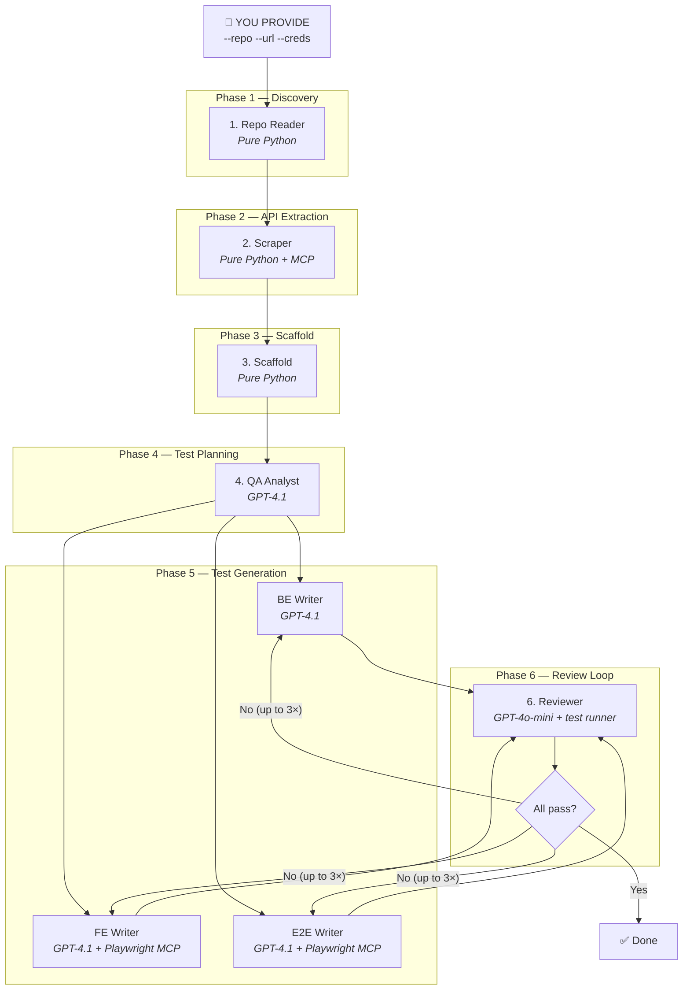
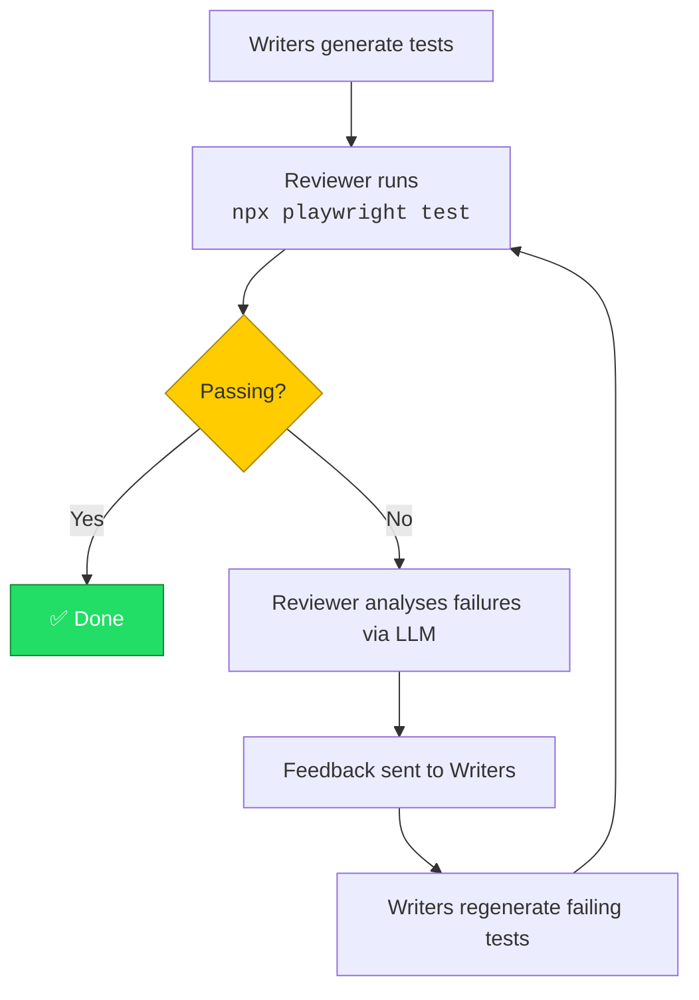

# TestForge

## Agentic AI Test Orchestration

> "We didn't write tests. We wrote the thing that writes tests."

---

## The Problem

- Writing comprehensive test suites is **time-consuming** and **repetitive**
- Teams skip tests under deadline pressure
- API, UI, and E2E tests require different expertise
- Maintaining test coverage as apps evolve is a never-ending task

---

## The Solution: TestForge

A **multi-agent AI system** that autonomously:

1. Reads your codebase
2. Plans a test strategy
3. Generates comprehensive Playwright test suites
4. Executes them
5. Self-corrects through feedback loops

**No human intervention beyond three inputs.**

---

## Three Inputs. Full Test Suite.

```bash
testforge \
  --repo  ./path/to/your/project \
  --url   https://your-app.example.com \
  --creds credentials.json
```

That's it.

---

## Tech Stack

| Component | Technology |
|-----------|-----------|
| Orchestration | CrewAI (Python) |
| LLM Backend | GitHub Models (GPT-4.1) |
| Test Framework | Playwright (TypeScript) |
| Browser Tools | Playwright MCP Server |
| Flow Control | Deterministic Python (no LLM routing) |

---

## Architecture — 7 Agents, 1 Pipeline



---

## Agent Tools

Each agent has purpose-built tools:

| Agent | Tools Available |
|-------|---------------|
| QA Analyst | `read_file`, `list_directory` |
| BE Test Writer | `read_file`, `list_directory` |
| FE Test Writer | `read_file`, `list_directory`, **Playwright MCP** |
| E2E Test Writer | `read_file`, **Playwright MCP** |
| Reviewer | `read_file`, `test_runner` |

**Playwright MCP** gives FE/E2E writers a real browser to explore the app — discover selectors, validate page structure, understand navigation flows.

---

## Output Structure

```
test-output/
├── playwright.config.ts
├── package.json
├── tsconfig.json
├── core/types/enums.ts
├── data/credentials/accounts.ts
├── fixtures/auth.fixture.ts
├── tests/
│   ├── api/          ← BE Writer output
│   │   ├── users.api.spec.ts
│   │   ├── auth.api.spec.ts
│   │   └── ...
│   ├── ui/           ← FE Writer output
│   │   ├── login.ui.spec.ts
│   │   ├── dashboard.ui.spec.ts
│   │   └── pages/    (Page Object Models)
│   └── e2e/          ← E2E Writer output
│       ├── user-onboarding.e2e.spec.ts
│       └── ...
└── reports/
```

---

## Demo Mode

For quick demonstrations and rate-limit-friendly runs:

```bash
testforge \
  --repo ./project \
  --url https://app.example.com \
  --creds credentials.json \
  --demo
```

### What Demo Mode Does

| Behaviour | Normal | Demo |
|-----------|--------|------|
| BE tests generated | All API resources | **3 resources max** |
| FE tests generated | All UI pages | **3 pages max** |
| E2E tests | Full journeys | **Skipped** |
| Review loop | Up to 3 iterations | Up to 3 iterations |

**Result:** ~6 test files instead of potentially dozens — fast, cheap, and enough to demonstrate the full pipeline working end-to-end.

---

## Demo Mode — Banner Output

```
============================================================
  TestForge — Agentic AI Test Orchestration
============================================================
  Repo:    C:\Projects\my-app
  App URL: https://my-app.example.com
  Output:  C:\Projects\my-app\test-output
  Roles:   admin, user, viewer
  Force:   False
  Mode:    DEMO (3 tests per agent, FE + BE only)
============================================================
```

---

## Self-Healing Loop



> Max 3 iterations before stopping.

---

## Key Design Decisions

1. **Deterministic routing** — Python controls the flow, not the LLM
2. **No shared browser state** — each agent gets isolated Playwright MCP
3. **Graceful degradation** — if MCP unavailable, agents proceed without it
4. **Token budget management** — inputs truncated to fit 8K windows
5. **Incremental mode** — detects existing framework, only adds new tests
6. **Rate-limit resilience** — retry with exponential backoff (5 retries)

---

## Running TestForge

### Prerequisites

```bash
pip install -e .        # Install TestForge
npm install -g npx      # For Playwright execution
```

### Environment

```bash
# .env file
GITHUB_TOKEN=ghp_xxxxx
```

### Full Run

```bash
testforge --repo ./my-app --url http://localhost:3000 --creds creds.json
```

### Demo Run

```bash
testforge --repo ./my-app --url http://localhost:3000 --creds creds.json --demo
```

---

## What's Next

- Concurrent agent execution (asyncio)
- Dev-provided MCP server integration for authoritative API specs
- Custom model selection per agent
- CI/CD integration (GitHub Actions)
- Coverage gap analysis on re-runs

---

## Summary

| | |
|---|---|
| **Input** | 3 things: repo path, app URL, credentials |
| **Process** | 7 agents in a deterministic pipeline |
| **Output** | Production-ready Playwright test suite |
| **Self-healing** | Tests are run and fixed automatically |
| **Demo mode** | Fast, cheap pipeline validation |

> TestForge: From zero to full test coverage in one command.
