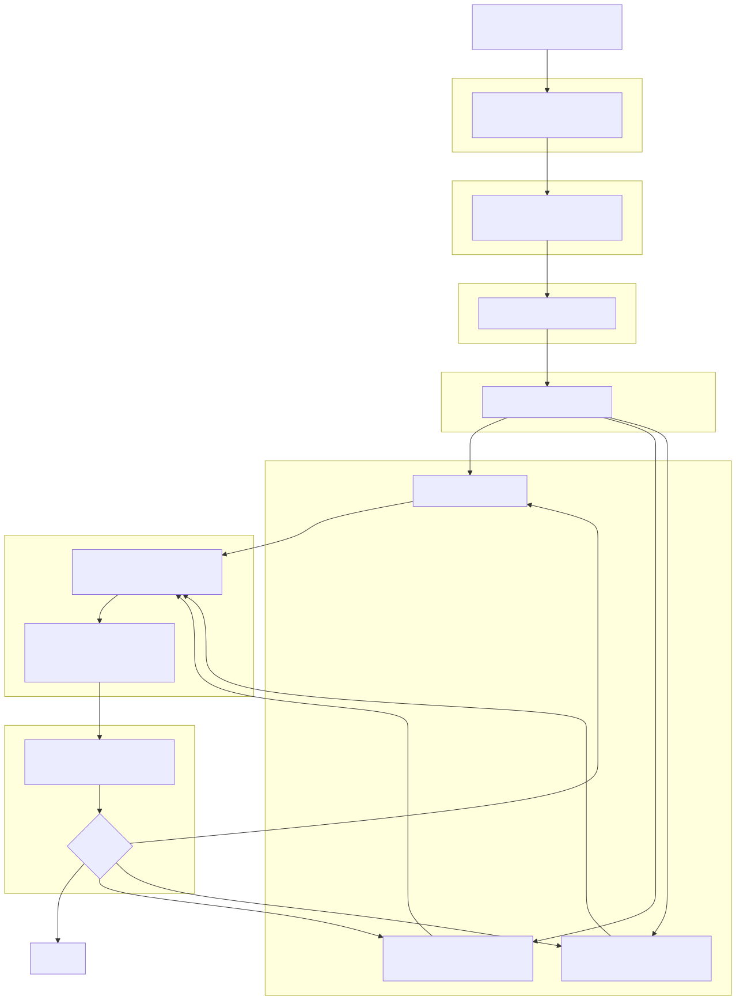
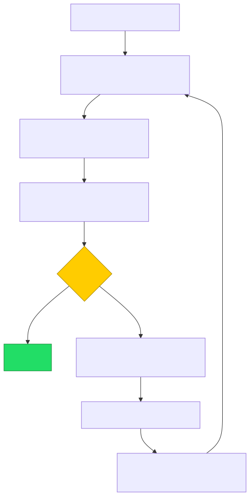

<style>
section {
  font-family: Georgia, "Aptos", serif;
  background:
    radial-gradient(circle at top right, rgba(81, 145, 204, 0.24), transparent 28%),
    radial-gradient(circle at top left, rgba(74, 170, 136, 0.14), transparent 24%),
    linear-gradient(180deg, #09131d 0%, #102133 100%);
  color: #eef6ff;
  padding: 52px 64px 72px 64px;
  line-height: 1.45;
}

p, li, td, th {
  color: #eef6ff;
}

h1, h2, h3 {
  color: #42e9f5;
  letter-spacing: -0.02em;
}

h1 {
  font-size: 2.2em;
  margin-bottom: 0.25em;
}

h2 {
  margin-top: 1.4em;
  border-bottom: 2px solid rgba(66, 233, 245, 0.5);
  padding-bottom: 0.2em;
}

h3 {
  margin-top: 1.2em;
}

blockquote {
  margin: 1.2em 0;
  padding: 0.9em 1.1em;
  background: rgba(255, 255, 255, 0.1);
  border-left: 6px solid #42e9f5;
  border-radius: 10px;
  color: #f3f9ff;
  box-shadow: 0 8px 20px rgba(5, 12, 19, 0.24);
}

table {
  font-size: 0.88em;
  background: rgba(255, 255, 255, 0.08);
  color: #eef6ff;
}

thead th {
  background: rgba(66, 233, 245, 0.2);
}

code, pre {
  font-family: "Cascadia Code", Consolas, monospace;
}

pre {
  border-radius: 12px;
  background: #0e1b27;
  color: #eaf4ff;
  padding: 18px;
}

.hero {
  padding: 22px 26px;
  border-radius: 16px;
  background: linear-gradient(135deg, rgba(10, 36, 52, 0.96), rgba(18, 95, 120, 0.94));
  color: white;
  box-shadow: 0 18px 42px rgba(10, 29, 46, 0.18);
}

.hero h1, .hero h2, .hero h3, .hero p, .hero strong {
  color: white;
  border-bottom: none;
}

.panel {
  margin: 1em 0;
  padding: 1em 1.1em;
  border-radius: 14px;
  background: rgba(255, 255, 255, 0.1);
  color: #eef6ff;
  box-shadow: 0 8px 24px rgba(5, 12, 19, 0.24);
}

.grid {
  display: grid;
  grid-template-columns: 1fr 1fr;
  gap: 18px;
}

.pill-row {
  display: flex;
  flex-wrap: wrap;
  gap: 10px;
  margin-top: 14px;
}

.pill {
  display: inline-block;
  padding: 8px 12px;
  border-radius: 999px;
  background: rgba(66, 233, 245, 0.18);
  color: #dffcff;
  font-size: 0.82em;
  font-weight: 600;
}

img {
  border-radius: 14px;
  box-shadow: 0 14px 34px rgba(15, 31, 48, 0.12);
  background: white;
}
</style>

<div class="hero">

# TestForge

### Agentic AI Test Orchestration for Playwright

**What the company should remember:** TestForge is not intended to replace automation testers. It is designed to give smaller teams a practical testing safety net when they do not have dedicated automation capacity.

**Presentation structure:** 10 minutes to explain the system, 2 minutes for a live run, 3 minutes for questions.

<div class="pill-row">
  <span class="pill">For small teams</span>
  <span class="pill">Safety net, not replacement</span>
  <span class="pill">Python orchestration</span>
  <span class="pill">Playwright output</span>
  <span class="pill">Self-healing loop</span>
</div>

</div>

> TestForge is best positioned as a practical workflow for teams that need some automation coverage but do not have the reach, budget, or headcount to place a full automation engineer on every team.

## 1. Executive Summary

TestForge is a deterministic Python pipeline that coordinates multiple AI agents to generate Playwright tests from a repository and a running application URL. It reads the codebase, plans test coverage, writes tests, bootstraps the output project, runs cleanup rules, executes the tests, and feeds failures back into another pass.

The key message for this presentation is:

1. TestForge helps smaller teams get a working testing workflow.
2. It does not claim to outperform a strong automation engineer.
3. It provides a useful safety net where there otherwise may be none.
4. The API lane is already strong enough to prove the concept today.

## 2. The Real Problem We Are Solving

<div class="grid">

<div class="panel">

### Smaller teams often lack

- Dedicated automation testers
- Enough time to build Playwright coverage from scratch
- Deep expertise across API, UI, and E2E automation
- The bandwidth to keep test suites current as the system changes

</div>

<div class="panel">

### What usually happens instead

- Manual testing becomes the only safety net
- Releases move faster than coverage
- Automation is deferred indefinitely
- Regression risk quietly grows over time

</div>

</div>

## 3. The Positioning

> TestForge is not a replacement for an automation tester. It is a support system for teams that need enough automated coverage to reduce risk when a dedicated automation specialist is not available.

That positioning matters because it keeps the expectations honest.

### What TestForge is

- A workflow accelerator
- A bootstrapper for Playwright suites
- A safety net builder
- A repeatable way to get from zero to some automated protection

### What TestForge is not

- A full substitute for an experienced test architect
- A claim that every generated test is perfect first time
- A promise that UI/E2E are fully proven in today’s demo

## 4. The One-Line Value Proposition

Give TestForge a repository path, a running app URL, and optional credentials, and it will build a Playwright project, generate tests, stabilize them, run them, and attempt to repair recurring defects automatically.

```bash
testforge \
  --repo  C:\path\to\repo \
  --url   http://localhost:5164 \
  --creds credentials.json \
  --skip-fe \
  --demo
```

## 5. Why This Matters to the Company

<div class="panel">

### Company value

- Gives smaller delivery teams a workable starting point for automation
- Reduces the cost of getting basic safety coverage in place
- Makes Playwright setup and scaffolding less manual
- Creates a reusable internal capability that can improve over time

</div>

## 6. What We Have Already Proven

- The system can run end-to-end from repo input to generated Playwright output.
- The API-only mode works as a valid demonstration path.
- The cleaner can deterministically repair repeated Playwright runtime mistakes.
- The pipeline can adapt when a frontend is not available.
- The output is a normal Playwright project, not a proprietary black box.

## 7. Agent Responsibilities

| Agent | Responsibility | Why it matters |
|---|---|---|
| Repo Reader | Read the repo and build context | Prevent blind generation |
| Scraper | Extract API structure and routes | Ground writers in real code |
| Scaffold | Create output framework structure | Ensure Playwright project exists |
| QA Analyst | Produce prioritized test plan | Separate planning from writing |
| BE Test Writer | Generate API tests | Fastest path to real value |
| FE Test Writer | Generate UI tests and page models | Frontend lane for future validation |
| E2E Test Writer | Generate journey tests | End-to-end workflow coverage |
| Janator | Bootstrap the output project | Remove environment friction |
| Code Cleaner | Apply deterministic repairs | Make generated code more runnable |
| Reviewer | Execute and feed back failures | Close the loop |

## 8. The Full Flow

This is the most important visual in the presentation because it makes the system understandable as an orchestration pipeline rather than a single prompt.



### Pipeline in plain English

1. **Repo Reader** inspects the repository and builds context.
2. **Scraper** extracts API structure and useful testable surfaces.
3. **Scaffold** ensures the Playwright project shape exists.
4. **QA Analyst** writes the test plan.
5. **Writers** generate tests for backend, frontend, and end-to-end lanes.
6. **Janator** prepares boilerplate and dependencies.
7. **Code Cleaner** fixes repeated structural and runtime issues.
8. **Reviewer** runs tests and decides whether another repair cycle is needed.

## 9. The Self-Healing Loop

The differentiator is not that AI wrote code. The differentiator is that the system keeps going after generation.



### Why this loop matters

- Writers produce plausible test code.
- Janator prepares the project to run.
- Code Cleaner catches recurring defects cheaply and deterministically.
- Reviewer runs the suite against the real target.
- Failures become input to the next pass instead of dead ends.

## 10. Janator and Code Cleaner Are the Credibility Layer

<div class="grid">

<div class="panel">

### Janator

- Ensures the generated project has the files it needs
- Prepares package and config structure
- Installs dependencies
- Reduces setup noise before tests are even executed

</div>

<div class="panel">

### Code Cleaner

- Removes markdown artifacts and import errors
- Fixes Playwright fixture misuse
- Fixes common API shape assumptions
- Normalizes repeated runtime failure patterns into deterministic rules

</div>

</div>

## 11. Examples of Reliability Hardening

These are strong points to speak to in the room because they show engineering depth, not just LLM output.

- Added `--skip-fe` for API-only projects with no frontend
- Relaxed credentials handling so simple username/password shapes are valid
- Fixed `request.newContext()` misuse on the Playwright request fixture
- Fixed `request.setBaseURL()` misuse on the Playwright request fixture
- Fixed request fixture reuse from `beforeAll` inside test cases
- Added response-shape normalizers for wrapped API payloads

## 12. Demo Inputs and Output

### Inputs

| Input | Meaning |
|---|---|
| `--repo` | Target codebase |
| `--url` | Running system under test |
| `--creds` | Optional credentials/context |
| `--skip-fe` | API-only mode |
| `--demo` | Faster presentation-friendly run |

### Output structure

```text
test-output/
├── playwright.config.ts
├── package.json
├── tsconfig.json
├── tests/
│   ├── api/
│   ├── ui/
│   └── e2e/
└── reports/
```

The output remains a standard Playwright project that a team can inspect, run, and evolve.

## 13. Demo Mode for the Presentation

| Behaviour | Full Run | Demo Mode |
|---|---|---|
| API coverage | Broad | Reduced sample |
| UI coverage | Broad | Reduced or skipped based on mode |
| E2E journeys | Full | Often skipped |
| Retry loop | Up to 3 iterations | Up to 3 iterations |

> Demo mode is the right way to present TestForge live. It keeps the run small enough to explain while still proving the architecture.

## 14. Today’s Proven Scope

### What we should confidently claim today

- API generation pipeline exists and runs
- API-only mode works when no frontend is present
- The orchestration story is real
- The stabilization story is real

### What we should position as next

- FE validation on a real frontend
- E2E proof on a live user journey
- Stronger grounding from richer repository scraping and authoritative API sources

## 15. Honest Positioning for Questions

| Likely question | Honest answer |
|---|---|
| Does this replace automation engineers? | No. It gives smaller teams a safety net when they do not have one. |
| Is it perfect first pass? | No. The architecture assumes iteration and repair. |
| Is frontend fully proven today? | Not yet. That is a next validation lane. |
| Is the concept proven? | Yes, especially on the API side. |
| Why is that valuable? | Because some automation protection is much better than none for small teams. |

## 16. Suggested Talk Track

### Minute 0 to 2

- Explain the team-size problem.
- Position TestForge as a support system, not a replacement.

### Minute 2 to 5

- Walk through the architecture diagram.
- Explain the responsibilities of each stage.

### Minute 5 to 7

- Focus on Janator and Code Cleaner.
- Explain why orchestration plus repair is the interesting part.

### Minute 7 to 9

- Show the API-only proof point and `--skip-fe`.
- Explain why this still proves the architecture.

### Minute 9 to 10

- Summarize business value for smaller teams.

## 17. Closing Message

<div class="hero">

## TestForge in one sentence

**A multi-agent workflow that helps smaller teams generate and stabilize Playwright automation so they have a safety net, even when they do not have a dedicated automation tester.**

### Today’s takeaway

The concept is already strong enough to present and justify further investment.

</div>

## 18. Q&A Backup

If someone asks, “Why not just ask ChatGPT to write tests?”

1. A single prompt does not give you a repeatable pipeline.
2. A single prompt does not bootstrap a runnable Playwright project.
3. A single prompt does not execute, inspect failures, and retry.
4. A single prompt does not accumulate deterministic fixes over time.

If someone asks, “Why would smaller teams use this?”

> Because smaller teams often cannot afford full automation coverage, but they still need a safety net. TestForge is designed to give them a workable path to that safety net.
